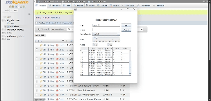

# Desain dan Pemrograman Berbasis Objek

---

## Tugas Praktikum 5

---

### Janji

---

Saya Fariz Wibisono dengan NIM 2307589 mengerjakan Tugas Praktikum 5 dalam mata kuliah Desain dan Pemrograman Berorientasi Objek untuk keberkahanNya maka saya tidak melakukan kecurangan seperti yang telah dispesifikasikan. Aamiin.

### Dokumentasi

---

Berikut adalah dokumentasi berupa rekaman hasil implementasi program:

### Penjelasan Alur Program

---

Program ini merupakan aplikasi berbasis GUI (Graphical User Interface) yang dirancang untuk mengelola data mahasiswa. Aplikasi ini memungkinkan pengguna untuk menambahkan, memperbarui, dan menghapus data mahasiswa yang terdiri dari atribut seperti NIM, nama, jenis kelamin, usia, dan kelas. Data mahasiswa ditampilkan dalam bentuk tabel, sehingga memudahkan pengguna untuk melihat dan mengelola informasi secara terstruktur.

Pengguna dapat mengisi formulir yang terdiri dari beberapa komponen seperti `JTextField` untuk NIM dan nama, `JComboBox` untuk memilih jenis kelamin, `JSlider` untuk menentukan usia, serta `JRadioButton` untuk memilih kelas. Tombol "Add" digunakan untuk menambahkan data baru, sedangkan tombol "Update" akan muncul ketika pengguna memilih baris tertentu di tabel untuk memperbarui data. Tombol "Delete" memungkinkan pengguna menghapus data setelah konfirmasi melalui dialog. Selain itu, tombol "Cancel" dapat digunakan untuk mengosongkan formulir dan mengatur ulang tampilan.

Program ini juga dilengkapi dengan validasi sederhana, seperti dialog konfirmasi sebelum menghapus data, untuk memastikan tindakan pengguna. Data yang dimasukkan akan disimpan dalam sebuah database MySQL. Setiap perubahan data, seperti penambahan, pembaruan, atau penghapusan, akan langsung tercermin di database. Koneksi ke database dilakukan menggunakan JDBC (Java Database Connectivity), dan data ditampilkan kembali di tabel menggunakan model tabel (`DefaultTableModel`). Dengan desain yang intuitif, aplikasi ini mempermudah pengelolaan data mahasiswa secara efisien.
